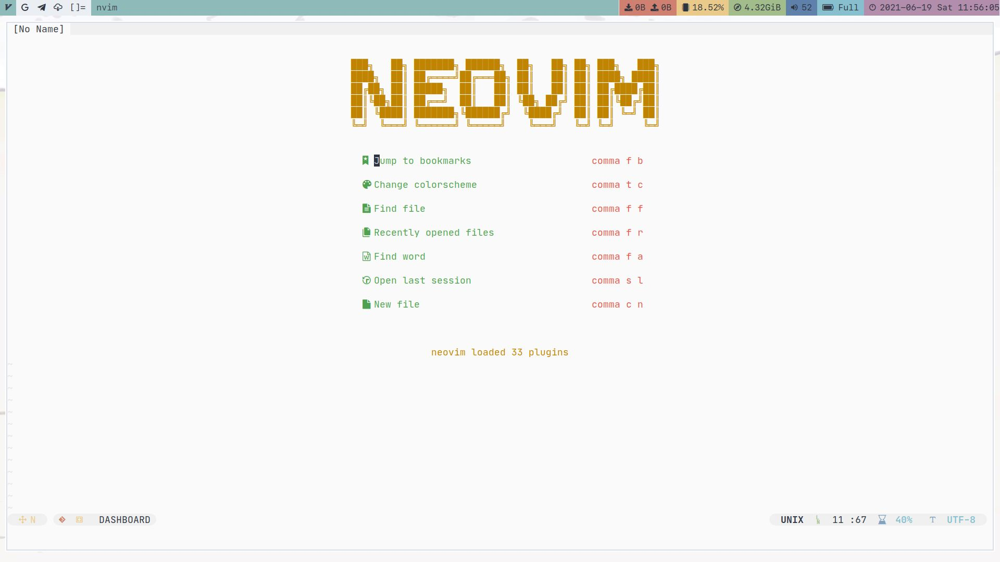
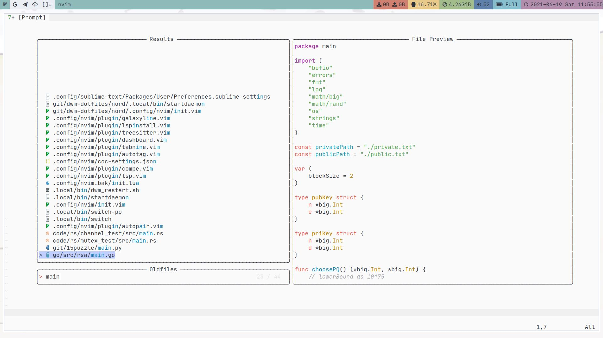
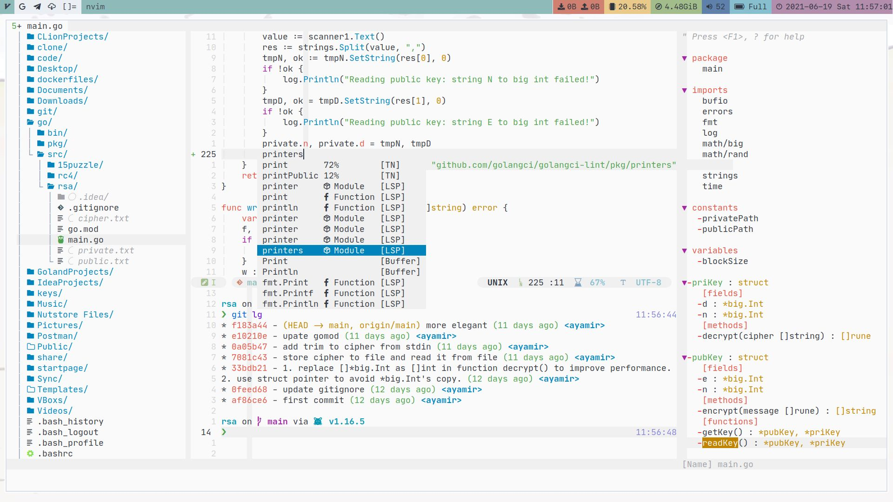

# Table of Contents

1. [Prerequisites](#prerequisites)
2. [Introduction](#introduction)
3. [Structure](#structure)
4. [Plugins](#plugins)
5. [Keybindings](#keybindings)
6. [Credit](#credit)

# Prerequisites

**Nvim version > 0.5**

# Introduction

This is my neovim's configuration.

I use [Vim-Plug](https://github.com/junegunn/vim-plug) to manage plugins.

I use [nvim-lspconfig](https://github.com/neovim/nvim-lspconfig) to realize code complete.

Chinese introduction is [here](https://zhuanlan.zhihu.com/p/382092667).

**Pros**:
+ Nvim native LSP to complete.
+ Classic but modern configuration.
+ Minimal but powerful configuration.
+ Flexible and fast configuration

# Structure

`init.vim` is the kernel config file.

The first part is the common settings of neovim.

The second part is Vim-Plug's settings which consists of all of my plugins.

The third part is common simple keybinding settings about some plugins.

`plugin` directory includes some plugins' specific settings.

# Plugins

## UI

| Name                                                                                          | Effect                              |
| :----:                                                                                        | :----:                              |
| [sonph/onehalf](https://github.com/sonph/onehalf)                                             | My light theme                      |
| [arcticicestudio/nord-vim](https://github.com/arcticicestudio/nord-vim)                       | My dark theme                       |
| [kyazdani42/nvim-web-devicons](https://github.com/kyazdani42/nvim-web-devicons)               | For nvim-tree's icons               |
| [glepnir/galaxyline.nvim](https://github.com/glepnir/galaxyline.nvim)                         | Minimal, fast but customizable line |
| [glepnir/dashboard-nvim](https://github.com/glepnir/dashboard-nvim)                           | Dashboard for Neovim                |
| [kyazdani42/nvim-tree.lua](https://github.com/kyazdani42/nvim-tree.lua)                       | Replacement of Nerdtree             |
| [akinsho/nvim-bufferline.lua](https://github.com/akinsho/nvim-bufferline.lua)                 | Replacement of nvim's buffer and tab |

## File jump

| Name                                                                              | Effect                      |
| :----:                                                                            | :----:                      |
| [nvim-lua/popup.nvim](https://github.com/nvim-lua/popup.nvim)                     | Required by telescope.nvim  |
| [nvim-lua/plenary.nvim](https://github.com/nvim-lua/plenary.nvim)                 | Required by telescope.nvim  |
| [nvim-telescope/telescope.nvim](https://github.com/nvim-telescope/telescope.nvim) | Find, Filter, Preview, Pick |

## Common coding tools

| Name                                                                                          | Effect                                  |
| :----:                                                                                        | :----:                                  |
| [godlygeek/tabular](https://github.com/godlygeek/tabular)                                     | Line up with regex                      |
| [Yggdroot/indentLine](https://github.com/Yggdroot/indentLine)                                 | Note each indent level                  |
| [lukas-reineke/indent-blankline.nvim](https://github.com/lukas-reineke/indent-blankline.nvim) | IndentLine's supplement                 |
| [tpope/vim-commentary](https://github.com/tpope/vim-commentary)                               | Comment code quickly                    |
| [majutsushi/tagbar](https://github.com/majutsushi/tagbar)                                     | Display code structure                  |
| [nvim-treesitter/nvim-treesitter](https://github.com/nvim-treesitter/nvim-treesitter)         | Super powerful code highlighter         |
| [sbdchd/neoformat](https://github.com/sbdchd/neoformat)                                       | Super powerful code formater            |
| [lewis6991/gitsigns.nvim](https://github.com/lewis6991/gitsigns.nvim)                         | Show git status in nvim                 |
| [windwp/nvim-autopairs](https://github.com/windwp/nvim-autopairs)                             | Powerful autopairs for Neovim           |
| [windwp/nvim-ts-autotag](https://github.com/windwp/nvim-ts-autotag)                           | Faster vim-closetag                     |
| [rhysd/accelerated-jk](https://github.com/rhysd/accelerated-jk)                               | Accelerated J/K                         |
| [justinmk/vim-sneak](https://github.com/justinmk/vim-sneak)                                   | Minimal easymotion, powerful vim motion |
| [junegunn/vim-slash](https://github.com/junegunn/vim-slash)                                   | Elegant search in vim                   |
| [vimlab/split-term](https://github.com/vimlab/split-term.vim)                                 | Utilites around neovim's `:terminal`    |
| [thinca/vim-quickrun](https://github.com/thinca/vim-quickrun)                                 | Just run code quickly                   |

## Specific coding tools
| Name                                                                            | Effect                                               |
| :----:                                                                          | :----:                                               |
| [neovim/nvim-lspconfig](https://github.com/neovim/nvim-lspconfig)               | Neovim native LSP configuration                      |
| [kabouzeid/nvim-lspinstall](https://github.com/kabouzeid/nvim-lspinstall)       | Manage every LSP engine                              |
| [onsails/lspkind-nvim](https://github.com/onsails/lspkind-nvim)                 | Vscode-like pictograms for neovim lsp                |
| [glepnir/lspsaga.nvim](https://github.com/glepnir/lspsaga.nvim)                 | Make Nvim LSP more useful                            |
| [hrsh7th/nvim-compe](https://github.com/hrsh7th/nvim-compe)                     | Auto completion plugin for nvim                      |
| [tzachar/compe-tabnine](https://github.com/tzachar/compe-tabnine)               | Tabnine port for nvim-compe                          |
| [hrsh7th/vim-vsnip](https://github.com/hrsh7th/vim-vsnip)                       | Snippets plugin supports LSP/VSCode's snippet format |
| [hrsh7th/vim-vsnip-integ](https://github.com/hrsh7th/vim-vsnip-integ)           | Vsnip integration to nvim's LSP                      |
| [rafamadriz/friendly-snippets](https://github.com/rafamadriz/friendly-snippets) | Set of preconfigured snippets                        |
| [fatih/vim-go](https://github.com/fatih/vim-go)                                 | Most powerful plugin for go                          |
| [rust-lang/rust.vim](https://github.com/rust-lang/rust.vim)                     | Plugin for rust                                      |
| [norcalli/nvim-colorizer.lua](https://github.com/norcalli/nvim-colorizer.lua)   | Display detected color                               |
| [iamcco/markdown-preview.nvim](https://github.com/iamcco/markdown-preview.nvim) | Markdown-preview out of box                          |

# Keybindings

The leader key is `,`.

| Effect                                                    | shortcut                                         |
| ----------------------------------                        | -------------------------------------            |
| install plugins                                           | `<leader><leader>i`                              |
| update plugins                                            | `<leader><leader>u`                              |
| clean Plugins                                             | `<leader><leader>c`                              |
| tabe init.vim                                             | `<leader><leader>v`                              |
|                                                           |                                                  |
| toggle nvim-tree                                          | `<Ctrl-N>`                                       |
| toggle tagbar                                             | `<leader>t`                                      |
|                                                           |                                                  |
| open terminal split                                       | `<Ctrl-W>t` or `<F5>`                            |
| open terminal vertical split                              | `<Ctrl-W>T`                                      |
| quit terminal                                             | `<Ctrl-D>`                                       |
| toggle floating terminal                                  | `<Alt-D>`                                        |
|                                                           |                                                  |
| operaions in nvim-tree                                    |                                                  |
| new file                                                  | `a`                                              |
| remove file/directory                                     | `d`                                              |
| rename file/directory                                     | `r`                                              |
| open directory                                            | `o`/`Enter`                                      |
| close directory                                           | `o`/`Backspace`                                  |
| copy filename                                             | `y`
| copy relative path                                        | `Y`                                              |
| copy absolute path                                        | `gy`                                             |
| toggle file/directory begin with dot                      | `H`                                              |
| toggle hidden file/directory configured in nvim-tree      | `I`                                              |
|                                                           |                                                  |
| find file in recently opened                              | `<leader>fr`                                     |
| find file in all files                                    | `<leader>ff`                                     |
| find file in opened buffers                               | `<leader>fb`                                     |
|                                                           |                                                  |
| find one character backward                               | `f`, input what you want to search then `return` |
| find two characters backward                              | `F`, input what you want to search               |
| find one character forward                                | `F`, input what you want to search then `return` |
| find two characters forward                               | `F`, input what you want to search               |
|                                                           |                                                  |
| back to last cursor's place                               | `<Ctrl-O>`                                       |
| jump to function's definition                             | `gd`                                             |
| smart rename                                              | `gr`                                             |
| show signature help                                       | `gs`                                             |
| show current function/variable's definition or references | `gh`                                             |
| show hover doc                                            | `K`                                              |
| show code action                                          | `<leader>ca`                                     |
| show code diagnostics                                     | `<leader>cd`                                     |
| navigate in vsnip's block                                 | `<Ctrl-l>`                                       |
|                                                           |                                                  |
| toggle one line's comment                                 | `gcc`                                            |
| toggle selected lines' comment                            | `<Shift-V>`, select area then `gc`               |
|                                                           |                                                  |
| toggle MarkdownPreView                                    | `<F12>`                                          |

You can see more keybinds in `init.vim` and other configuration files in `plugin` directory.

# Credit

+ [nerd-galaxyline](https://github.com/Avimitin/nerd-galaxyline) as my galaxyline's template.
