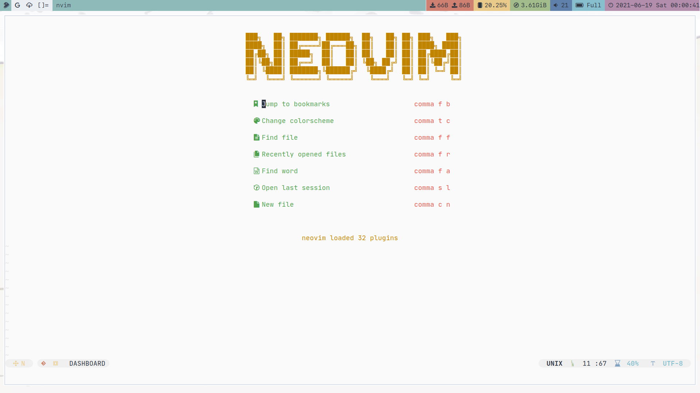
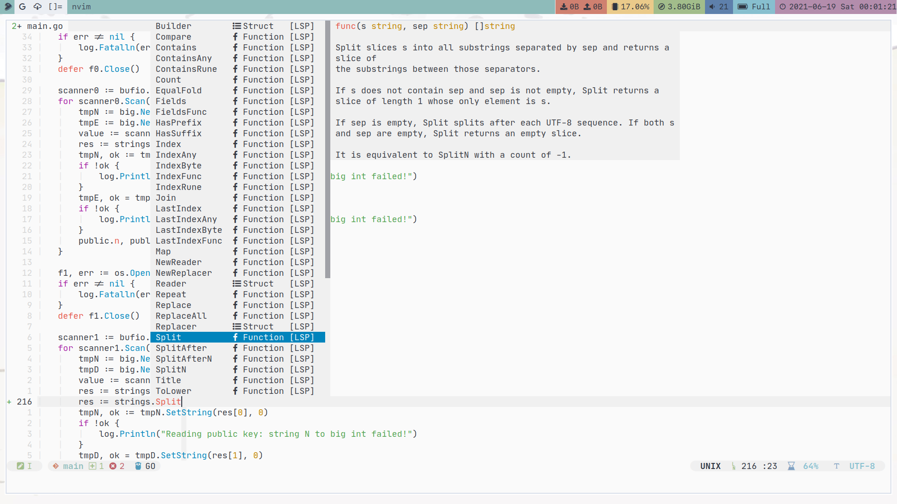
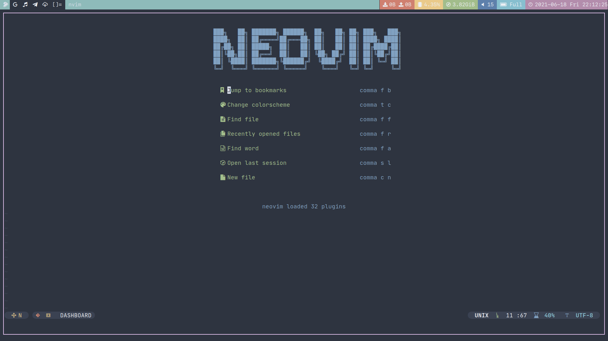
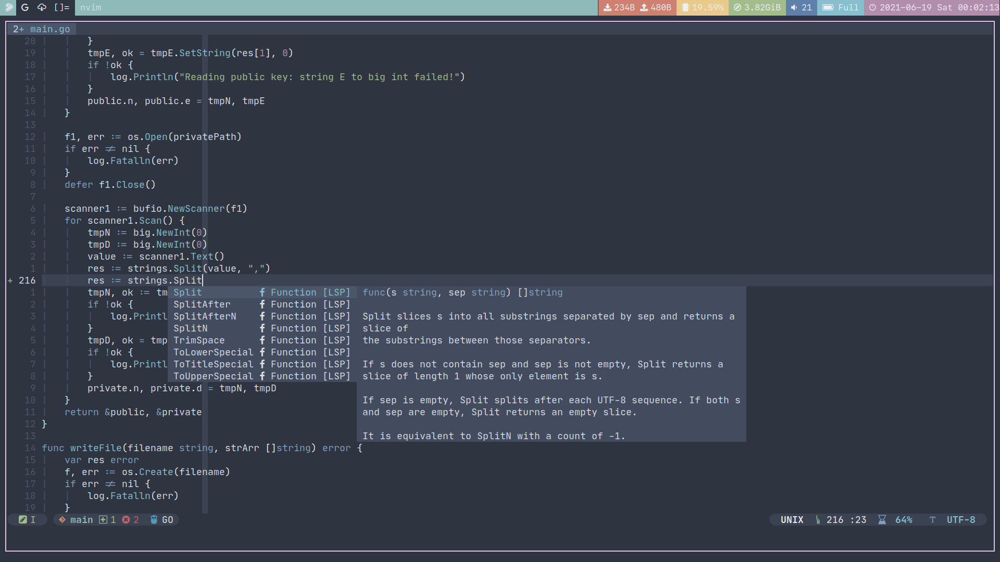

# Table of Contents

1. [Prerequisites](#prerequisites)
2. [Introduction](#introduction)
3. [Structure](#structure)
4. [Plugins](#plugins)
5. [Usage](#usage)

# Prerequisites

**Nvim version > 0.5**

# Introduction

This is my neovim's configuration.

I use [Vim-Plug](https://github.com/junegunn/vim-plug) to manage plugins.

I use [nvim-lspconfig](https://github.com/neovim/nvim-lspconfig) to realize code complete.

# Structure

`init.vim` is the kernel config file.

The first part is the common settings of neovim.

The second part is Vim-Plug's settings which consists of all of my plugins.

The third part is common simple keybinding settings about some plugins.

`plugin` directory includes some plugins' specific settings.

# Plugins

## UI

| Name                                                                 | Effect                              |
| :----:                                                               | :----:                              |
| [onehalf](https://github.com/sonph/onehalf)                          | My light theme                      |
| [nord-vim](https://github.com/arcticicestudio/nord-vim)              | My dark theme                       |
| [nvim-web-devicons](https://github.com/kyazdani42/nvim-web-devicons) | For nvim-tree's icons               |
| [galaxyline.nvim](https://github.com/glepnir/galaxyline.nvim)        | Minimal, fast but customizable line |
| [dashboard-nvim](https://github.com/glepnir/dashboard-nvim)          | Dashboard for Neovim                |
| [nvim-tree.lua](https://github.com/kyazdani42/nvim-tree.lua)         | Replacement of Nerdtree             |

## File jump

| Name                                                               | Effect                      |
| :----:                                                             | :----:                      |
| [popup.nvim](https://github.com/nvim-lua/popup.nvim)               | Required by telescope.nvim  |
| [plenary.nvim](https://github.com/nvim-lua/plenary.nvim)           | Required by telescope.nvim  |
| [telescope.nvim](https://github.com/nvim-telescope/telescope.nvim) | Find, Filter, Preview, Pick |

## Common coding tools

| Name                                                                  | Effect                                  |
| :----:                                                                | :----:                                  |
| [tabular](https://github.com/godlygeek/tabular)                       | Line up with regex                      |
| [indentLine](https://github.com/Yggdroot/indentLine)                  | Note each indent level                  |
| [vim-commentary](https://github.com/tpope/vim-commentary)             | Comment code quickly                    |
| [tagbar](https://github.com/majutsushi/tagbar)                        | Display code structure                  |
| [nvim-treesitter](https://github.com/nvim-treesitter/nvim-treesitter) | Super powerful code highlighter         |
| [neoformat](https://github.com/sbdchd/neoformat)                      | Super powerful code formater            |
| [vim-gitgutter](https://github.com/airblade/vim-gitgutter)            | Show git status in nvim                 |
| [nvim-autopairs](https://github.com/windwp/nvim-autopairs)            | Powerful autopairs for Neovim           |
| [nvim-ts-autotag](https://github.com/windwp/nvim-ts-autotag)          | Faster vim-closetag                     |
| [accelerated-jk](https://github.com/rhysd/accelerated-jk)             | Accelerated J/K                         |
| [vim-sneak](https://github.com/justinmk/vim-sneak)                    | Minimal easymotion, powerful vim motion |
| [vim-slash](https://github.com/junegunn/vim-slash)                    | Elegant search in vim                   |
| [split-term](https://github.com/vimlab/split-term.vim)                | Utilites around neovim's `:terminal`    |
| [vim-quickrun](https://github.com/thinca/vim-quickrun)                | Just run code quickly                   |

## Specific coding tools
| Name                                                                     | Effect                                |
| :----:                                                                   | :----:                                |
| [nvim-lspconfig](https://github.com/neovim/nvim-lspconfig)               | Neovim native LSP configuration       |
| [nvim-lspinstall](https://github.com/kabouzeid/nvim-lspinstall)          | Manage every LSP engine               |
| [lspkind-nvim](https://github.com/onsails/lspkind-nvim)                  | Vscode-like pictograms for neovim lsp |
| [nvim-compe](https://github.com/hrsh7th/nvim-compe)                      | Auto completion plugin for nvim       |
| [compe-tabnine](https://github.com/tzachar/compe-tabnine)                | Tabnine port for nvim-compe           |
| [snippets.nvim](https://github.com/norcalli/snippets.nvim)               | Snippets port for nvim-compe          |
| [vim-go](https://github.com/fatih/vim-go)                                | Most powerful plugin for go           |
| [rust.vim](https://github.com/rust-lang/rust.vim)                        | Plugin for rust                       |
| [vim-css-color](https://github.com/ap/vim-css-color)                     | Display detected color                |
| [markdown-preview.nvim](https://github.com/iamcco/markdown-preview.nvim) | Markdown-preview out of box           |

# Keybindings

The leader key is comma.

| Effect                                                    | shortcut                                         |
| ----------------------------------                        | -------------------------------------            |
| install plugins                                           | `<leader><leader>i`                              |
| update plugins                                            | `<leader><leader>u`                              |
| clean Plugins                                             | `<leader><leader>c`                              |
| tabe init.vim                                             | `<leader><leader>v`                              |
|                                                           |                                                  |
| toggle nvim-tree                                          | `<Ctrl-N>`                                       |
| toggle tagbar                                             | `<leader>t`                                      |
|                                                           |                                                  |
| open terminal split                                       | `<Ctrl-W>t` or `<F5>`                            |
| open terminal vertical split                              | `<Ctrl-W>T`                                      |
| quit terminal                                             | `<Ctrl-D>`                                       |
| toggle floating terminal                                  | `<Alt-D>`                                        |
|                                                           |                                                  |
| operaions in nvim-tree                                    |                                                  |
| new file                                                  | `a`                                              |
| remove file/directory                                     | `d`                                              |
| rename file/directory                                     | `r`                                              |
| open directory                                            | `o`/`Enter`                                      |
| close directory                                           | `o`/`Backspace`                                  |
| copy filename                                             | `y`
| copy relative path                                        | `Y`                                              |
| copy absolute path                                        | `gy`                                             |
| toggle file/directory begin with dot                      | `H`                                              |
| toggle hidden file/directory configured in nvim-tree      | `I`                                              |
|                                                           |                                                  |
| find file in recently opened                              | `<leader>fr`                                     |
| find file in all files                                    | `<leader>ff`                                     |
| find file in opened buffers                               | `<leader>fb`                                     |
|                                                           |                                                  |
| find one character backward                               | `f`, input what you want to search then `return` |
| find two characters backward                              | `F`, input what you want to search               |
| find one character forward                                | `F`, input what you want to search then `return` |
| find two characters forward                               | `F`, input what you want to search               |
|                                                           |                                                  |
| back to last cursor's place                               | `<Ctrl-O>`                                       |
| jump to function's definition                             | `gd`                                             |
| smart rename                                              | `gr`                                             |
| show signature help                                       | `gs`                                             |
| show current function/variable's definition or references | `gh`                                             |
| show hover doc                                            | `K`                                              |
| show code action                                          | `<leader>ca`                                     |
| show code diagnostics                                     | `<leader>cd`                                     |
| navigate in vsnip's block                                 | `<Ctrl-l>`                                       |
|                                                           |                                                  |
| toggle one line's comment                                 | `gcc`                                            |
| toggle selected lines' comment                            | `<Shift-V>`, select area then `gc`               |
|                                                           |                                                  |
| toggle MarkdownPreView                                    | `<F12>`                                          |

You can see more keybinds in `init.vim` and other configuration files in `plugin` directory.
