# Table of Contents

1. [Introduction](#introduction)
2. [Prerequisites](#prerequisites)
3. [Structure](#structure)
4. [Plugins](#plugins)
5. [Keybindings](#keybindings)
6. [Issues](#issues)
7. [Credit](#credit)
8. [TODO](#todo)

<a id="introduction"></a>

# Introduction

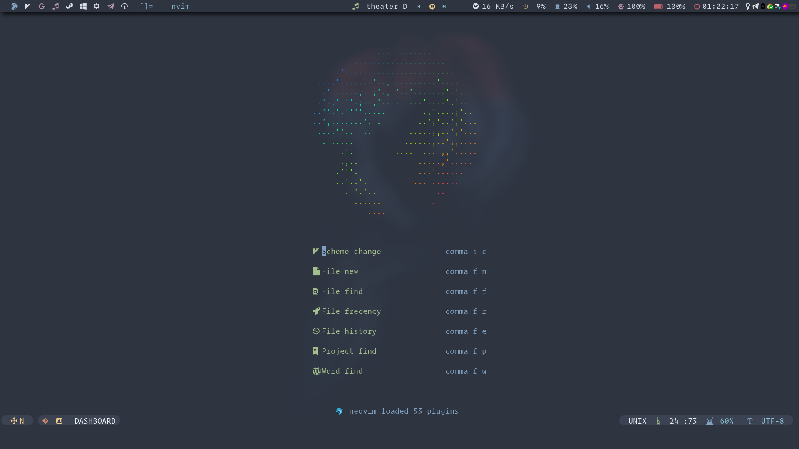

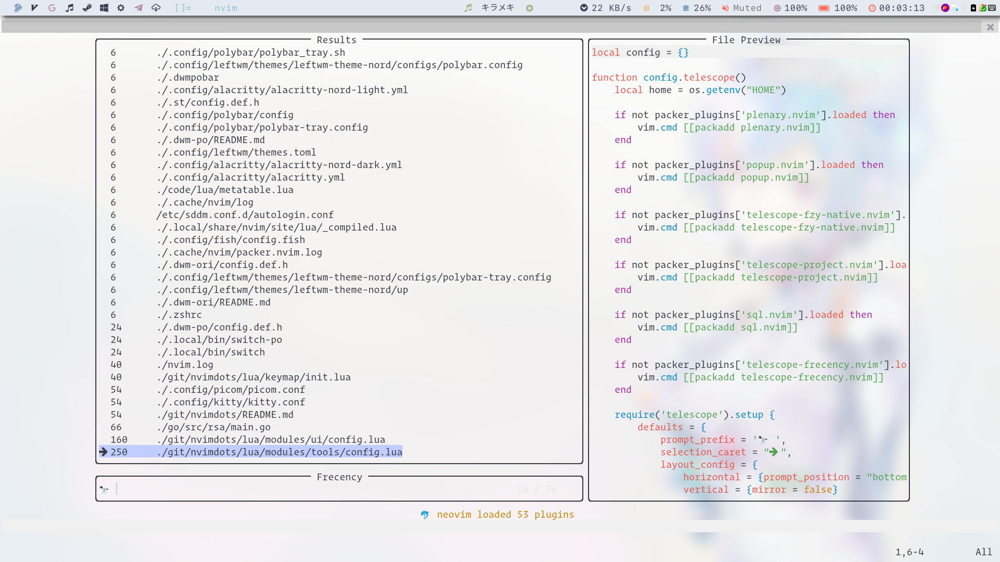

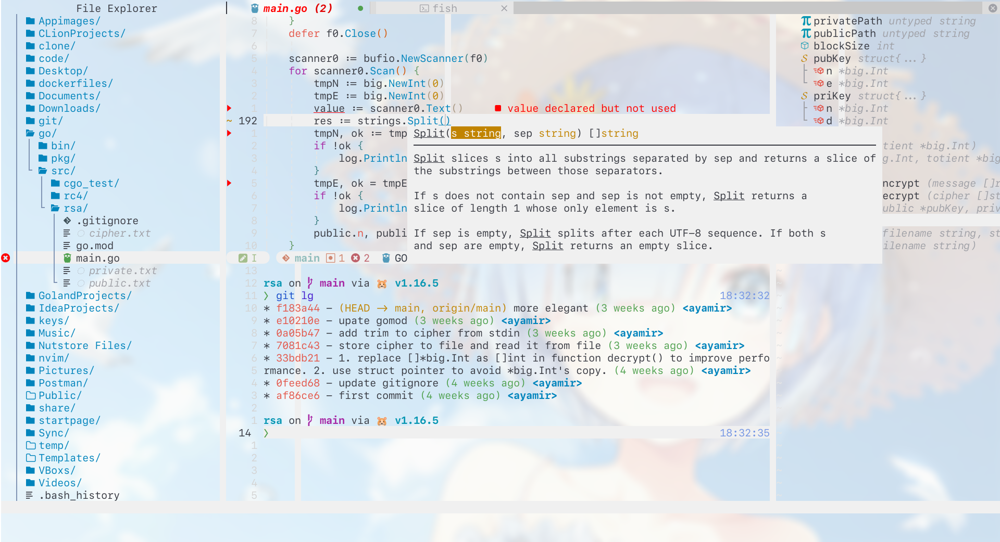

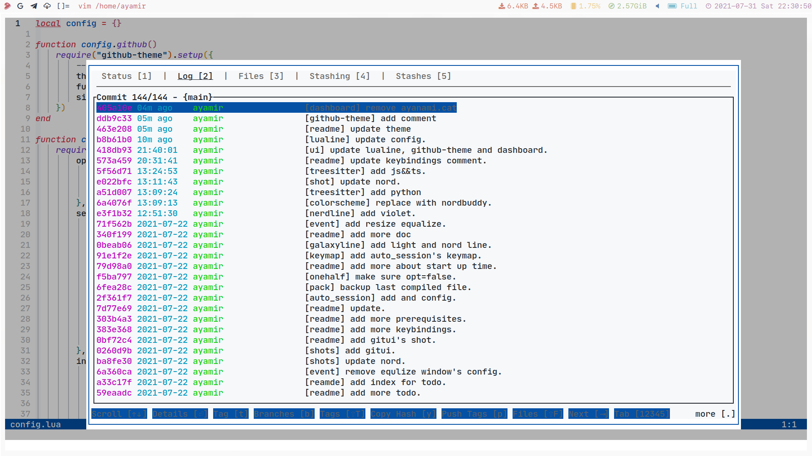

This is my neovim's configuration, which contains four branch.

I use [packer.nvim](https://github.com/wbthomason/packer.nvim) to manage plugins.

| Branch |   Completion Solution   |
| :----: | :---------------------: |
|  main  | nvim-lspconfig+nvim-cmp |
|  coq   | nvim-lspconfig+coq_nvim |
|  coc   |        coc.nvim         |

Chinese introduction is [here](https://zhuanlan.zhihu.com/p/382092667).

**Pros**:

- Fast. Less than **50ms** to start(Depends on SSD, tested on Sumsung 970 evo).
- Simple. Run out of the box.
- Modern. Pure lua to config.
- Modular. Easy to customize.
- Powerful. Full functionality to code.

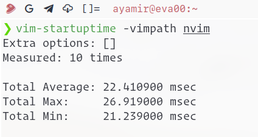

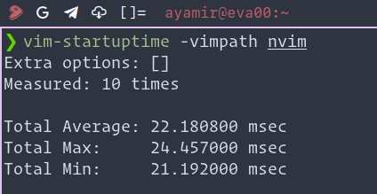

(Tested with [rhysd/vim-startuptime](https://github.com/rhysd/vim-startuptime))

<a id="prerequisites"></a>

# Prerequisites

1. Neovim base installation for archlinux

```shell
# gitui required by tui git operations
# ripgrep required by telescope word search engine
# ripgrep required by telescope-zoxide
# sqlite required by telescope-frecency
# fd required by telescope file search engine
# yarn required by markdown preview
# nerd-fonts-ibm-plex-mono required by devicons
sudo pacman -S git gitui zoxide ripgrep sqlite fd yarn nerd-fonts-ibm-plex-mono

# nodejs, neovim-git required by copilot.
# neovim version >= 0.6
yay -S nodejs neovim-git

# for neovim python module
pip install neovim --user

# clone
git clone https://github.com/ayamir/nvimdots ~/.config/nvim

# sync plugins(maybe need multiple times)
nvim +PackerSync
```

2. Recommended Terminals:

   [alacritty](https://github.com/alacritty/alacritty), [kitty](https://sw.kovidgoyal.net/kitty), [wezterm](https://wezfurlong.org/wezterm/)

```shell
sudo pacman -S alacritty kitty wezterm
```

3. Recommended GUI applications:

   [neovide](https://github.com/Kethku/neovide), [goneovim](https://github.com/akiyosi/goneovim)

```shell
paru neovide
paru goneovim
```

4. Tools for plugins

- For [nvim-lsp-installer](https://github.com/williamboman/nvim-lsp-installer#available-lsps), you
  need to install corresponding language server use it.

- For [nvim-treesitter](https://github.com/nvim-treesitter/nvim-treesitter#supported-languages), all maintained parser will be installed by default.

- For [format.nvim](https://github.com/sbdchd/neoformat#supported-filetypes), you
  need to install corresponding formatter manually:

```shell
# clangformat for c/cpp etc
sudo pacman -S clang
# gofmt and goimports for golang
go get -u golang.org/x/tools/...
# lua-format for lua
paru -S lua-format-git
# yapf and autopep8 for python
pip install autopep8 yapf --user
# rustfmt
sudo pacman -S rustup
# on the stable toolchain
rustup component add rustfmt
# on the nightly toolchain
rustup component add rustfmt --toolchain nightly
# prettier for markdown/html etc
sudo pacman -S prettier
# jq for json
sudo pacman -S jq
# shfmt for shell
sudo pacman -S shfmt
```

<a id="structure"></a>

# Structure

`init.lua` is the kernel config file. It requires configuration in `lua`
directory.

- `lua` directory contains 3 parts.

  - `core` directory contains base configuration of neovim.

  - `keymap` directory contains keybindings of plugins.

  - `modules` directory contains 5 parts.

    - `completion` directory contains code completion's configuration.

    - `editor` directory contains plugins' configuration about editing.

    - `lang` directory contains plugins' configuration about specific language.

    - `tools` directory contains telescope and its extensions' configuration.

    - `ui` directory contains plugins' configuration about ui.

## How to customize

- Add plugin

  1. Determine this plugin belongs to what kind(completion, editor, lang, tools,
     ui).

  2. Add a list item in corresponding `plugins.lua`.

     For example, I want to add [rmagatti/auto-session](https://github.com/rmagatti/auto-session) to `editor` category.

     Then I need to modify `lua/modules/editor/plugins.lua`:

     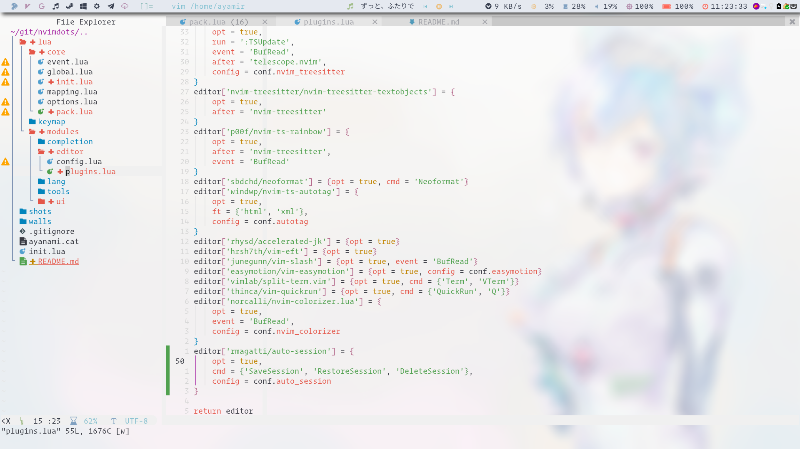

     (You should learn how to use [packer.nvim](https://github.com/wbthomason/packer.nvim) install and configure plugin on
     your own)

     I also need to modify `lua/modules/editor/config.lua`:

     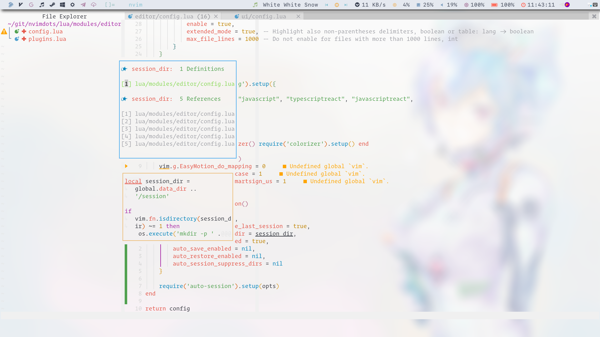

     Then press `<leader>ps`:

     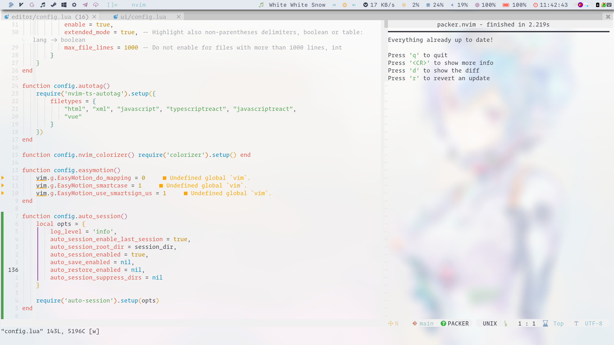

     Then try its command: `SaveSession`

     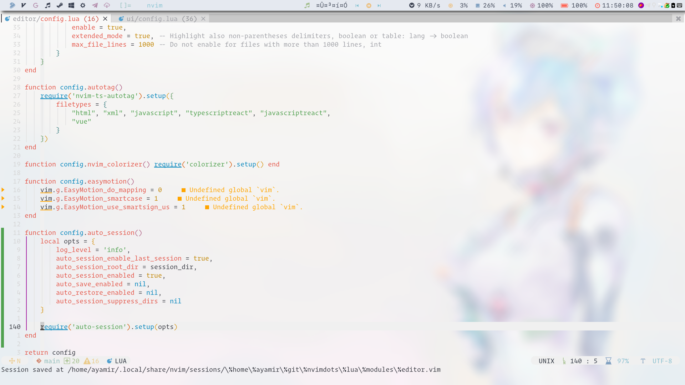

     Then restart nvim and execute `RestoreSession`.

     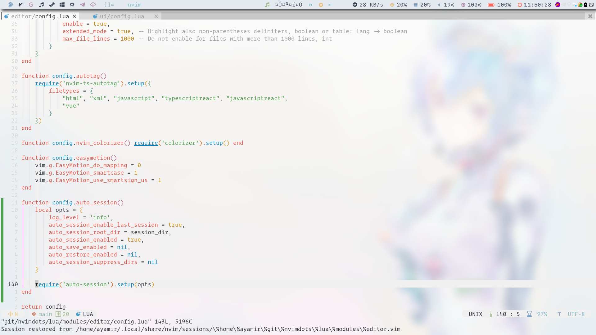

     So this plugin is added successfully!

- Remove plugin

  1. Determine this plugin belongs to what kind(completion, editor, lang, tools,
     ui).

  2. Remove its config located in corresponding `plugins.lua` and `config.lua`.

  3. Remove corresponding keymap if exists.

  4. Press `<leader>ps` to recompile.

- Modify keymap

  - For vanilla nvim's keymap

    modify `lua/core/mapping.lua`

  - For specific plugin's keymap

    modify `lua/keymap/init.lua`

- Modify event defined by `autocmd`

  modify `lua/core/event.lua`

- Modify vanilla nvim's options

  modify `lua/core/options.lua`

- Switch light/dark theme

```shell
# To light
    sed -i "s/\=dark/\=light/g" ~/.config/nvim/lua/modules/ui/config.lua
    sed -i "s/onedark/onelight/g" ~/.config/nvim/lua/modules/ui/config.lua
# To Dark
    sed -i "s/\=light/\=dark/g" ~/.config/nvim/lua/modules/ui/config.lua
    sed -i "s/onelight/onedark/g" ~/.config/nvim/lua/modules/ui/config.lua
```

You need to execute `PackerSync` or just press `<leader>ps` to compile the latest config if you modify the
any config in `lua` directory.

Don't worry if you meet any error for your new config.

The old compiled file called `bak_compiled.lua` is located in
`$HOME/.local/share/nvim/site/lua` directory.

If you just want to restore to old config:

```shell
cd $HOME/.local/share/nvim/site/lua
cp ./bak_compiled.lua ./_compiled.lua
```

Then you can figure out what modification makes error.

<a id="plugins"></a>

# Plugins

## UI

|                                             Name                                              |               Effect                |
| :-------------------------------------------------------------------------------------------: | :---------------------------------: |
|                        [sainnhe/edge](https://github.com/sainnhe/edge)                        |         My light/dark theme         |
|        [kyazdani42/nvim-web-devicons](https://github.com/kyazdani42/nvim-web-devicons)        |        For nvim-tree's icons        |
|                [hoob3rt/lualine.nvim](https://github.com/hoob3rt/lualine.nvim)                | Minimal, fast but customizable line |
|              [glepnir/dashboard-nvim](https://github.com/glepnir/dashboard-nvim)              |        Dashboard for Neovim         |
|            [kyazdani42/nvim-tree.lua](https://github.com/kyazdani42/nvim-tree.lua)            |       Replacement of Nerdtree       |
|             [lewis6991/gitsigns.nvim](https://github.com/lewis6991/gitsigns.nvim)             |       Show git status in nvim       |
| [lukas-reineke/indent-blankline.nvim](https://github.com/lukas-reineke/indent-blankline.nvim) |  Show indent with different level   |
|             [akinsho/bufferline.nvim](https://github.com/akinsho/bufferline.nvim)             |      Tab and buffer management      |

## Tools

|                                                  Name                                                   |               Effect                |
| :-----------------------------------------------------------------------------------------------------: | :---------------------------------: |
|                      [nvim-lua/popup.nvim](https://github.com/nvim-lua/popup.nvim)                      |     Required by telescope.nvim      |
|                    [nvim-lua/plenary.nvim](https://github.com/nvim-lua/plenary.nvim)                    |     Required by telescope.nvim      |
|                         [tami5/sqlite.lua](https://github.com/tami5/sqlite.lua)                         | Required by telescope-frecency.nvim |
|            [nvim-telescope/telescope.nvim](https://github.com/nvim-telescope/telescope.nvim)            |     Find, Filter, Preview, Pick     |
| [nvim-telescope/telescope-fzy-native.nvim](https://github.com/nvim-telescope/telescope-fzy-native.nvim) |      Fzy search for telescope       |
|    [nvim-telescope/telescope-project.nvim](https://github.com/nvim-telescope/telescope-project.nvim)    |   Manage projects with telescope    |
|   [nvim-telescope/telescope-frecency.nvim](https://github.com/nvim-telescope/telescope-frecency.nvim)   |   Frequent and recent file cache    |
|                      [thinca/vim-quickrun](https://github.com/thinca/vim-quickrun)                      |          Run code quickly           |
|                         [michaelb/sniprun](https://github.com/michaelb/sniprun)                         |      Run code snippet quickly       |
|                       [folke/trouble.nvim](https://github.com/folke/trouble.nvim)                       |       Show code troubles etc        |
|                     [folke/which-key.nvim](https://github.com/folke/which-key.nvim)                     |     Help you learn keybindings      |
|                 [dstein64/vim-startuptime](https://github.com/dstein64/vim-startuptime)                 |    Profiling starup time quickly    |
|                       [gelguy/wilder.nvim](https://github.com/gelguy/wilder.nvim)                       |        More useful wild menu        |

## Editor

|                                                     Name                                                      |                Effect                |
| :-----------------------------------------------------------------------------------------------------------: | :----------------------------------: |
|                      [itchyny/vim-cursorword](https://github.com/itchyny/vim-cursorword)                      |        Highlight cursor word         |
|                     [junegunn/vim-easy-align](https://github.com/junegunn/vim-easy-align)                     |            Easy alignment            |
|                    [terrortylor/nvim-comment](https://github.com/terrortylor/nvim-comment)                    |         Comment code quickly         |
|               [simrat39/symbols-outline.nvim](https://github.com/simrat39/symbols-outline.nvim)               |        Display code structure        |
|             [nvim-treesitter/nvim-treesitter](https://github.com/nvim-treesitter/nvim-treesitter)             |   Super powerful code highlighter    |
| [nvim-treesitter/nvim-treesitter-textobjects](https://github.com/nvim-treesitter/nvim-treesitter-textobjects) |     Select text objects quickly      |
|              [romgrk/nvim-treesitter-context](https://github.com/romgrk/nvim-treesitter-context)              |         Show current context         |
|                        [p00f/nvim-ts-rainbow](https://github.com/p00f/nvim-ts-rainbow)                        |           Rainbow brackets           |
| [JoosepAlviste/nvim-ts-context-commentstring](https://github.com/JoosepAlviste/nvim-ts-context-commentstring) |       Comment base on context        |
|        [mfussenegger/nvim-ts-hint-textobject](https://github.com/mfussenegger/nvim-ts-hint-textobject)        |     Select region like hop.nvim      |
|                           [SmiteshP/nvim-gps](https://github.com/SmiteshP/nvim-gps)                           |   Show current context in lualine    |
|                        [andymass/vim-matchup](https://github.com/andymass/vim-matchup)                        |        Better matchup for `%`        |
|                     [jdhao/better-escape.vim](https://github.com/jdhao/better-escape.vim)                     |       Replace `esc` with `jk`        |
|                   [lukas-reineke/format.nvim](https://github.com/lukas-reineke/format.nvim)                   |      Format code asynchronously      |
|                      [windwp/nvim-ts-autotag](https://github.com/windwp/nvim-ts-autotag)                      |         Faster vim-closetag          |
|                 [norcalli/nvim-colorizer.lua](https://github.com/norcalli/nvim-colorizer.lua)                 |        Display detected color        |
|                        [rhysd/accelerated-jk](https://github.com/rhysd/accelerated-jk)                        |           Accelerated j/k            |
|                             [hrsh7th/vim-eft](https://github.com/hrsh7th/vim-eft)                             |             Enhanced f/t             |
|                            [phaazon/hop.nvim](https://github.com/phaazon/hop.nvim)                            |      `easymotion`'s replacement      |
|                       [karb94/neoscroll.nvim](https://github.com/karb94/neoscroll.nvim)                       |            smooth scroll             |
|                         [vimlab/split-term](https://github.com/vimlab/split-term.vim)                         | Utilites around neovim's `:terminal` |
|                 [akinsho/nvim-toggleterm.lua](https://github.com/akinsho/nvim-toggleterm.lua)                 |           Toggled terminal           |
|                         [numtostr/FTerm.nvim](https://github.com/numtostr/FTerm.nvim)                         |            Float terminal            |

## Completion

|                                         Name                                          |                       Effect                       |
| :-----------------------------------------------------------------------------------: | :------------------------------------------------: |
|           [neovim/nvim-lspconfig](https://github.com/neovim/nvim-lspconfig)           |          Neovim native LSP configuration           |
| [williamboman/nvim-lsp-installer](https://github.com/williamboman/nvim-lsp-installer) |               Manage each LSP engine               |
|        [ray-x/lsp_signature.nvim](https://github.com/ray-x/lsp_signature.nvim)        | Show signature when completing function parameters |
|                [hrsh7th/nvim-cmp](https://github.com/hrsh7th/nvim-cmp)                |          Auto completion plugin for nvim           |
|              [hrsh7th/cmp-buffer](https://github.com/hrsh7th/cmp-buffer)              |             buffer source for nvim-cmp             |
|                [hrsh7th/cmp-path](https://github.com/hrsh7th/cmp-path)                |              path source for nvim-cmp              |
|             [tzachar/cmp-tabnine](https://github.com/tzachar/cmp-tabnine)             |            tabnine source for nvim-cmp             |
|            [hrsh7th/cmp-nvim-lua](https://github.com/hrsh7th/cmp-nvim-lua)            |              lua source for nvim-cmp               |
|            [hrsh7th/cmp-nvim-lsp](https://github.com/hrsh7th/cmp-nvim-lsp)            |              lsp source for nvim-cmp               |
|                [f3fora/cmp-spell](https://github.com/f3fora/cmp-spell)                |             spell source for nvim-cmp              |
|        [andersevenrud/compe-tmux](https://github.com/andersevenrud/compe-tmux)        |              tmux source for nvim-cmp              |
|        [saadparwaiz1/cmp_luasnip](https://github.com/saadparwaiz1/cmp_luasnip)        |            luasnip source for nvim-cmp             |
|                [L3MON4D3/LuaSnip](https://github.com/L3MON4D3/LuaSnip)                |      snippets completion engine for nvim-cmp       |
|    [rafamadriz/friendly-snippets](https://github.com/rafamadriz/friendly-snippets)    |            snippets source for LusSnip             |
|           [windwp/nvim-autopairs](https://github.com/windwp/nvim-autopairs)           |                  Completion pairs                  |
|                [github/copilot](https://github.com/github/copilot.vim)                |                Copilot neovim port                 |

## Lang

|                                      Name                                       |           Effect            |
| :-----------------------------------------------------------------------------: | :-------------------------: |
|                 [fatih/vim-go](https://github.com/fatih/vim-go)                 | Most powerful plugin for go |
|           [rust-lang/rust.vim](https://github.com/rust-lang/rust.vim)           |       Plugin for rust       |
|     [simrat39/rust-tools.nvim](https://github.com/simrat39/rust-tools.nvim)     |       Plugin for rust       |
|  [kristijanhusak/orgmode.nvim](https://github.com/kristijanhusak/orgmode.nvim)  |      Org mode in nvim       |
| [iamcco/markdown-preview.nvim](https://github.com/iamcco/markdown-preview.nvim) | Markdown-preview out of box |

<a id="keybindings"></a>

# Keybindings

The leader key is `,`.

|                          Effect                           |            shortcut            |
| :-------------------------------------------------------: | :----------------------------: |
|                  sync config and compile                  |          `<leader>ps`          |
|                      install plugins                      |          `<leader>pi`          |
|                      update plugins                       |          `<leader>pu`          |
|                       clean plugins                       |          `<leader>pc`          |
|                                                           |                                |
|                     toggle nvim-tree                      |            `<C-n>`             |
|                       toggle tagbar                       |            `<A-t>`             |
|                                                           |                                |
|                 open horizontal terminal                  |       `<C-w>t` or `<F5>`       |
|                 toggle vertical terminal                  |            `<C-\>`             |
|                       quit terminal                       |            `<C-d>`             |
|                 toggle floating terminal                  |            `<A-d>`             |
|               force quit floating terminal                |           `<A-S-d>`            |
|             open `gitui` in current directory             |          `<leader>g`           |
|                                                           |                                |
|               pick buffer `n`(`n`means No)                |            `<A-n>`             |
|                       right buffer                        |            `<A-j>`             |
|                        left buffer                        |            `<A-k>`             |
|               move current buffer to right                |           `<A-S-k>`            |
|                move current buffer to left                |           `<A-S-k>`            |
|                   close current buffer                    |            `<A-q>`             |
|                force close current buffer                 |           `<A-S-q>`            |
|                  split buffer vertically                  |            `<C-w>v`            |
|                 split buffer horizontally                 |            `<C-w>s`            |
|                                                           |                                |
|                       navigate down                       |            `<C-j>`             |
|                        navigate up                        |            `<C-k>`             |
|                       navigate left                       |            `<C-h>`             |
|                      navigate right                       |            `<C-l>`             |
|                                                           |                                |
|                 operaions in `nvim-tree`                  |                                |
|                         new file                          |              `a`               |
|                   remove file/directory                   |              `d`               |
|                   rename file/directory                   |              `r`               |
|                      open directory                       |          `o`/`Enter`           |
|                      close directory                      |        `o`/`Backspace`         |
|                       copy filename                       |              `y`               |
|                    copy relative path                     |              `Y`               |
|                    copy absolute path                     |              `gy`              |
|           toggle file/directory begin with dot            |              `H`               |
|   toggle hidden file/directory configured in nvim-tree    |              `I`               |
|                                                           |                                |
|               find file in recently opened                |          `<leader>fr`          |
|                   find file in history                    |          `<leader>fe`          |
|            find file in current work directory            |          `<leader>ff`          |
|            find directory recorded by `zoxide`            |          `<leader>fz`          |
|                       find project                        |          `<leader>fp`          |
|                        add project                        |    `<leader>fp`then`<C-A>`     |
|                      delete project                       |    `<leader>fp`then`<C-D>`     |
|                                                           |                                |
|                       find one word                       |          `<leader>w`           |
|                    find one character                     |          `<leader>c`           |
|                    find two characters                    |          `<leader>cc`          |
|                     jump to one line                      |    `<leader>j`/`<leader>k`     |
|                                                           |                                |
|                    escape insert mode                     |              `jk`              |
|                      format manually                      |           `<C-A-l>`            |
|                back to last cursor's place                |            `<C-O>`             |
|                    preview definition                     |              `gd`              |
|                    jump to definition                     |              `gD`              |
|                       smart rename                        |              `gr`              |
|                  toggle last diagnostics                  |              `gt`              |
|                   toggle lsp references                   |              `gR`              |
|                    show signature help                    |              `gs`              |
| show current function/variable's definition or references |              `gh`              |
|                      show hover doc                       |              `K`               |
|                     show code action                      |          `<leader>ca`          |
|              toggle lsp document diagnostics              |          `<leader>cd`          |
|             toggle lsp workspace diagnostics              |          `<leader>cw`          |
|                   toggle code quickfix                    |          `<leader>cq`          |
|                    toggle code loclist                    |          `<leader>cl`          |
|                                                           |                                |
|                   next snippet's block                    |            `<C-l>`             |
|                   prev snippet's block                    |            `<C-h>`             |
|                                                           |                                |
|                 select current `()` block                 |             `vab`              |
|                 select current `{}` block                 |             `vaB`              |
|            select current outer function block            |             `vaf`              |
|             select current outer class block              |             `vac`              |
|            select current inner function block            |             `vif`              |
|             select current inner class block              |             `vic`              |
|                                                           |                                |
|                move to next function begin                |              `][`              |
|                move to prev function begin                |              `[[`              |
|                 move to next function end                 |              `]]`              |
|                 move to prev function end                 |              `[]`              |
|                                                           |                                |
|                 toggle one line's comment                 |             `gcc`              |
|              toggle selected lines' comment               | `<S-V>`, select area then `gc` |
|                                                           |                                |
|                  toggle MarkdownPreView                   |            `<F12>`             |
|                                                           |                                |
|                   Save current session                    |          `<leader>ss`          |
|                   Restore last session                    |          `<leader>sr`          |
|                    Delete last session                    |          `<leader>sd`          |
|        Debug mode only supports golang&python now         |                                |
|                    Debug continue(run)                    |       `<leader>dr`/`F6`        |
|                      Debug run last                       |         `<leader>drl`          |
|                    Debug run to cursor                    |         `<leader>drc`          |
|                  Debug toggle breakpoint                  |          `<leader>db`          |
|            Debug set breakpoint with condition            |          `<leader>dB`          |
|                   Debug list breakpoint                   |         `<leader>dbl`          |
|                      Debug open repl                      |          `<leader>dl`          |
|                      Debug step over                      |       `<leader>dv`/`F9`        |
|                      Debug step into                      |       `<leader>di`/`F10`       |
|                      Debug step out                       |       `<leader>do`/`F11`       |
|                     Debug disconnect                      |          `<leader>dd`          |
|                      Git management                       |                                |
|                         Prev hunk                         |              `[g`              |
|                         Next hunk                         |              `]g`              |
|                        Stage hunk                         | `<leader>hs`(`n` and `v` mode) |
|                        Reset hunk                         | `<leader>hr`(`n` and `v` mode) |
|                      Undo stage hunk                      |          `<leader>hu`          |
|                       Reset buffer                        |          `<leader>hR`          |
|                       Preview hunk                        |          `<leader>hp`          |
|                        Blame hunk                         |          `<leader>hb`          |

You can see more keybinds in `lua/core/mapping.lua` and `lua/keymap/init.lua`.

<a id="issues"></a>

# Issues

1. Clipboard for WSL2 users

Please refer to [it](https://github.com/neovim/neovim/wiki/FAQ#how-to-use-the-windows-clipboard-from-wsl) and add `win32yank.exe` to your path.

Then uncomment [this line](https://github.com/ayamir/nvimdots/blob/4ed10ccc71937cc86460f23da5ec646eec32125f/lua/core/init.lua#L147).

2. Wrong configuration may invoke the dialog asking for deleting all plugins

Input `n` and `<CR>`

3. LSP servers don't autostart.

Please check [this](https://github.com/neovim/nvim-lspconfig/blob/master/doc/server_configurations.md) to make sure your directory can be detected as a working directory.

For example (gopls):

Your root directory need a `go.mod` and your `.go` file need to be created
first. Then LSP will autostart when you edit `.go` file next time.

4. Copilot setup

Make sure your github account is signed up for [copilot](https://copilot.github.com/).

Then use `Copilot setup` command to setup.

<a id="credit"></a>

# Credit

- [glepnir/nvim](https://github.com/glepnir/nvim) as my config organization template.

<a id="todo"></a>

# TODO

- [x] More documentation for how to customize.
- [x] Backup old compiled configuration when error occurs.
